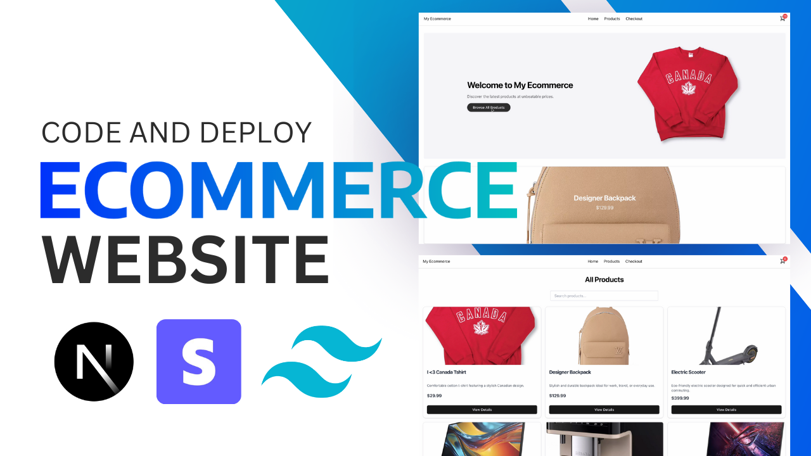

# Full‑Stack Ecommerce Platform

<div align="center">
  <br />
  <a href="https://youtu.be/DLeAPn5-TIA" target="_blank">
    
  </a>
  <br />
  <div>
    
    
    
    
    
  </div>
</div>


# QuickCart 1.0.0  

## 📌 About  
QuickCart 1.0.0 is a modern, full-stack e-commerce application designed for seamless online shopping. It features a **sleek UI, dynamic product interactions, real-time cart updates, and secure payments** powered by **Stripe**. Built with **Next.js 15**, it leverages **server components** for optimized performance, ensuring a fast and responsive shopping experience.  

---

## ⚙️ Tech Stack  
- **Next.js 15** – Utilizes server components and modern routing for enhanced performance and SEO.  
- **TypeScript** – Ensures type safety and maintainability.  
- **Tailwind CSS v4** – Provides a highly customizable, responsive design with utility-first styling.  
- **Zustand** – Handles lightweight, efficient client-side state management.  
- **Stripe API** – Enables secure product management and payment processing.  

---

## 🚀 Features & Functionality  
✅ **Dynamic Product Carousel** – Auto-cycling carousel showcasing featured products on the landing page.  
✅ **Responsive Product Pages** – Interactive product pages with quantity adjustment buttons.  
✅ **Real-Time Cart Updates** – Navbar cart icon updates instantly using Zustand.  
✅ **Seamless Stripe Checkout** – Secure, frictionless checkout with Stripe integration.  
✅ **Modern UI & UX** – Professional design inspired by shadcn components for a smooth user experience.  

---

## 🔧 Setup & Installation  

1️⃣ **Clone the repository:**  
```bash
git clone https://github.com/cole319/QuickCart-1.0.0.git
cd QuickCart-1.0.0
